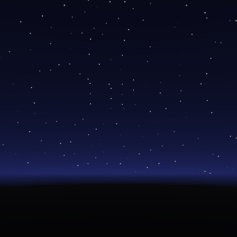
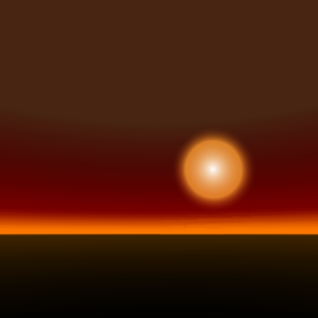

# Unity Skybox Shaders

## Skybox-StarrySky.shader
Procedural starry sky based on builtin *Skybox-Procedural.shader*.

## Skybox-LatLong.shader
Latitude-longitude style textures can be used **without converting them to cube maps**. Switch off mipmap generation when using this.

